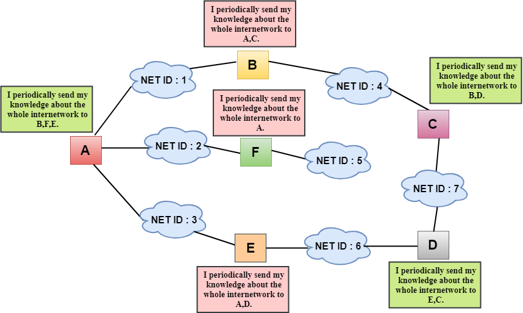

A distance-vector routing (DVR) protocol requires that a router inform its neighbors of topology changes periodically. Historically known as the old ARPANET routing algorithm (or known as Bellman-Ford algorithm)

- iterative 
- asynchronous 
- distributed 

## Working 

1. Knowledge about the whole network 
2. Routing only to neighbours 
3. Information sharing at regular intervals 

https://en.wikipedia.org/wiki/Bellman%E2%80%93Ford_algorithm

