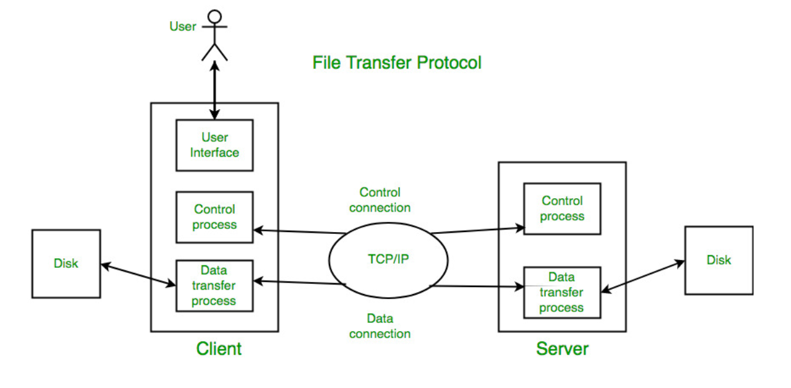

Introduction
---
**File Transfer Protocol** is an _application layer protocol_ that moves between local and remote file systems. 
- runs of top of **TCP**
- 2 TCP connections used: control connections and data connections 
- HTTP lack clarity and focus compared to FTP
- ASCII default share format 
- each character encoded by NVT ASCII 

Types of FTP
--
1. Anonymous FTP - enabled on files available for public access( without username or password )
2. Password Protected FTP 
3. FTP Secure(FTPS)- When FTP connection established, Transport Layer Security enabled 
4. FTP over Explicit SSl/TLS (FTPES) - upgrading FTP connection from port 21 to an encrypted connection
5. Secure FTP(SFTP) - subset of Secure Shell Protocol, works on port 22 

Modes of FTP 
--
1. **Active FTP** : 
In the active mode, the client connects on a _random port_ for incoming data connections from the server. Client again sends next port to FTP server which is acknowledged on command channel. 

 

2. **Passive FTP** : I
n the passive mode, the client uses the control connection to send a _PASV signal_ to the server. FTP server sends back IP address and server port number.

  

Types of Connection
---

### Control Connection

- For sending control information like user identification, password, commands to change the remote directory, commands to retrieve and store files, etc., FTP makes use of a control connection. 
- The control connection is initiated on port number 21. 

### Data connection

- For sending the actual file, FTP makes use of a data connection. 
- A data connection is initiated on port number 20. 

`FTP sends the control information out-of-band as it uses a separate control connection.`

FTP Data Types
---

1. ASCII: 
    
    Describes an ASCII text file in which each line is indicated by the previously mentioned type of end-of-line marker.
2. EBCDIC: 
    
    For files that use IBM’s EBCDIC character set, this type is conceptually identical to ASCII.
3. Image: 

    This is the “black box” mode; the file has no formal internal structure and is transferred one byte at a time without any processing.
    
4. Local: 

    Files containing data in logical bytes with a bit count other than eight can be handled by this data type.

FTP Replies
---

    200 – Command okay.
    530 – Not logged in.
    331 –  User name okay, need a password.
    221 – Service closing control connection.
    551 – Requested action aborted: page type unknown.
    502 – Command not implemented.
    503 – Bad sequence of commands.
    504 – Command not implemented for that parameter. 

Characteristics of FTP 
---

- FTP uses TCP as a transport layer protocol.
- It is good for simple file transfers, such as during boot time.
- Errors in the transmission (lost packets, checksum errors) must be handled by the TFTP server.
- It uses only one connection through well-known port 69.
- TFTP uses a simple lock-step protocol (each data packet needs to be acknowledged). Thus the throughput is limited.
