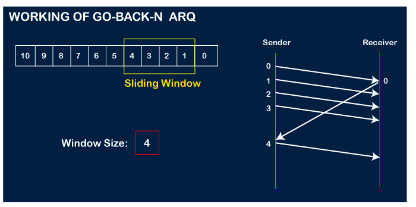

## Theory 

Go-Back-N protocol, also called Go-Back-N Automatic Repeat reQuest, is a data link layer protocol that uses a sliding window method for reliable and sequential delivery of data frames. 

## Points to note

- In Go-Back-N, N determines the sender's window size, and the size of the receiver's window is always 1.
- It does not consider the corrupted frames and simply discards them.
- It does not accept the frames which are out of order and discards them.
- If the sender does not receive the acknowledgment, it leads to the retransmission of all the current window frames.

## Working images 

