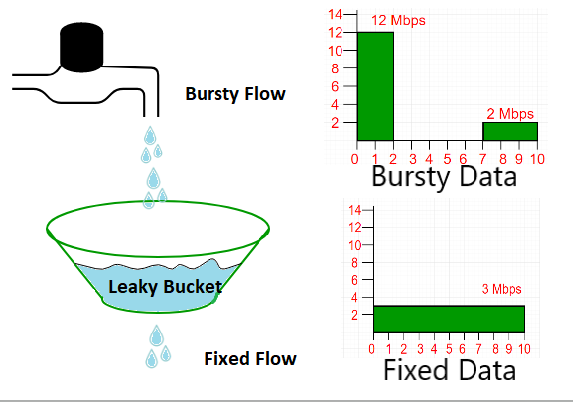

In network layer, for Quality of Services it must know what traffic is being guaranteed. 

 

One of the main causes of congestion is that traffic is often bursty.

 

Traffic Shaping is a mechanism to control the amount and rate of traffic sent to the network. 

 

There are 2 types :
 
1. Leaky Bucket 
2. Token Bucket 

## Applications of Leaky Bucket Algorithm

1. Traffic Shaping:
 
The Leaky Bucket Algorithm is commonly used for traffic shaping in networks to regulate the data flow and prevent congestion.
It ensures a steady and controlled transmission rate, reducing the risk of network bottlenecks.
2. Rate Limiting:
 
Online services often employ the Leaky Bucket Algorithm for rate limiting to control the rate at which requests or data are processed.
 
This helps prevent abuse, ensures fair usage, and maintains system stability.

3. Quality of Service (QoS):
 
In scenarios where different types of traffic (e.g., voice, video, and data) compete for bandwidth, the Leaky Bucket Algorithm can be used to prioritize and allocate resources based on predefined rules.

## Advantages 

1. Predictable Data Flow: 
-  predictable and consistent flow of data
- prevents sudden bursts that can disrupt the network.
2. Prevention of Congestion: 
- prevent network congestion by smoothing out the data flow and avoiding spikes in traffic.
3. Fair Resource Allocation: 
- In scenarios where multiple users or applications share a common resource, the Leaky Bucket Algorithm ensures fair and equitable distribution of resources.